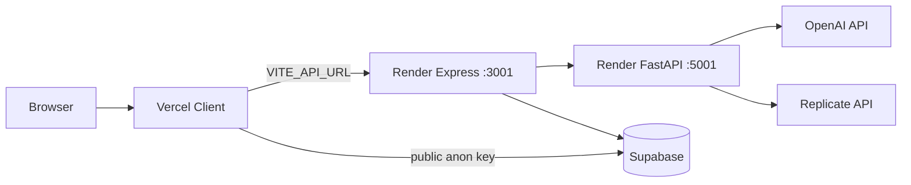

# Vision Studio — Deployment Notes

**CSE 115A Capstone · UCSC Spring 2026**

This document covers local and production runtime architecture, environment variables, build/start commands, and common deployment issues for Vision Studio.

---

## 1. Runtime Architecture

### Local development (three processes)

| Process | Directory | Command | URL |
|---------|-----------|---------|-----|
| Express API | `server/` | `npm run dev` | http://localhost:3001 |
| React client | `client/` | `npm run dev` | http://localhost:5173 |
| Python AI | `python/` | `uvicorn app:app --host 0.0.0.0 --port 5001 --reload` | http://localhost:5001 |

Health checks:

```bash
curl http://localhost:3001/health
curl http://localhost:3001/api/status
curl http://localhost:5001/health
```

The Vite dev server proxies `/api` and `/uploads` to port 3001 (`client/vite.config.js`).

### Production (typical)

| Service | Platform | Repository path | Role |
|---------|----------|-----------------|------|
| **vision-studio** (client) | Vercel | `client/` | Static SPA + `vercel.json` SPA rewrites |
| **vision-studio-server** (API) | Render | `server/` | Express REST + chat + export |
| **vision-studio-python** (AI) | Render | `python/` | FastAPI floor plan parse + recognition |
| **Database** | Supabase | `supabase/schema.sql` | PostgreSQL + Auth + RLS |



**Optional:** `marketing/` is a separate Next.js app (port 3000) — not required for the core editor deployment.

---

## 2. Initial Setup

### 2.1 Install dependencies

```bash
cd client && npm install
cd ../server && npm install
cd ../python && python3 -m venv venv
source venv/bin/activate          # Windows: venv\Scripts\activate
pip install -r requirements.txt
```

### 2.2 Environment files

| File | Used by | Purpose |
|------|---------|---------|
| `.env` (repo root) | Express + Python | Secrets and service config |
| `client/.env.local` | Vite client | Public API URL + Supabase anon key |
| `python/.env` (optional) | Python overrides | Local overrides |
| `marketing/.env.local` (optional) | Next.js | Marketing Supabase keys |

Copy templates:

```bash
cp .env.example .env
cp client/.env.example client/.env.local
cp python/.env.example python/.env   # optional
```

### 2.3 Database

```bash
# Apply schema (Supabase SQL Editor or script)
node server/scripts/applySchema.js [DB_PASSWORD]

# Seed furniture catalog
cd server && node scripts/seedFurniture.js

# Verify
cd server && node scripts/setup.js
```

---

## 3. Environment Variables by Service

### 3.1 Root `.env` — Express server (Render: `vision-studio-server`)

| Variable | Required | Description |
|----------|----------|-------------|
| `SUPABASE_URL` or `NEXT_PUBLIC_SUPABASE_URL` | Yes (for persistence) | Supabase project URL |
| `SUPABASE_SERVICE_ROLE_KEY` | Yes (for persistence) | Admin key for DB writes |
| `SUPABASE_PUBLIC_ANON_KEY` or `NEXT_PUBLIC_SUPABASE_PUBLISHABLE_KEY` | Yes | JWT verification |
| `OPENAI_API_KEY` | Yes | Chat assistant + layout LLM calls |
| `PYTHON_SERVICE_URL` | Yes (production) | e.g. `https://vision-studio-python.onrender.com` |
| `PORT` | No | Default `3001` |
| `NODE_ENV` | No | `development` or `production` |
| `CLIENT_ORIGIN` | Yes (production) | Stable Vercel production URL |
| `CLIENT_ORIGINS` | No | Comma-separated extra origins |
| `ALLOW_VERCEL_PREVIEWS` | Recommended | `true` to allow `*.vercel.app` previews |
| `REPLICATE_API_TOKEN` | No | Only if server proxies room-photo routes |
| `MESHY_API_KEY` | No | Optional `/api/models` 3D generation |
| `LOG_LEVEL` | No | `debug` / `info` / `warn` / `error` |

**Placeholder detection:** Values like `your-project.supabase.co` trigger in-memory fallback mode — `/api/status` returns `unconfigured` and the app runs demo mode without remote DB.

### 3.2 `client/.env.local` — Vite client (Vercel)

| Variable | Required | Description |
|----------|----------|-------------|
| `VITE_API_URL` | Yes | Express API URL (production Render URL) |
| `NEXT_PUBLIC_SUPABASE_URL` | Yes | Supabase project URL |
| `NEXT_PUBLIC_SUPABASE_PUBLISHABLE_KEY` | Yes | Supabase anon/publishable key |

Legacy aliases `VITE_SUPABASE_URL` and `VITE_SUPABASE_ANON_KEY` are also accepted.

**Never set in client env:** `OPENAI_API_KEY`, `REPLICATE_API_TOKEN`, `SUPABASE_SERVICE_ROLE_KEY`.

### 3.3 Python `.env` — FastAPI (Render: `vision-studio-python`)

Python loads root `.env`, then `server/.env`, then `python/.env` (in that order).

| Variable | Required | Description |
|----------|----------|-------------|
| `OPENAI_API_KEY` | Yes | Floor plan Vision parsing |
| `REPLICATE_API_TOKEN` | For recognition | DINO + SAM 2 room photo endpoints |
| `SUPABASE_URL` | No | If Python writes to Supabase directly |
| `SUPABASE_SERVICE_ROLE_KEY` | No | Same |
| `PORT` | No | Default `5001`; Render sets `$PORT` |

---

## 4. Build and Start Commands

### 4.1 Client (Vercel)

| Script | Command | Notes |
|--------|---------|-------|
| Dev | `npm run dev` | Vite on :5173 |
| Build | `npm run build` | `vite build` → `dist/` |
| Preview | `npm run preview` | Local production preview |
| Test | `npm test` | Vitest unit tests |

**Vercel settings:**

- **Root directory:** `client`
- **Build command:** `npm run build`
- **Output directory:** `dist`
- **Rewrites:** `client/vercel.json` sends all routes to `index.html` (SPA)

Set Vercel environment variables: `VITE_API_URL`, `NEXT_PUBLIC_SUPABASE_URL`, `NEXT_PUBLIC_SUPABASE_PUBLISHABLE_KEY`.

### 4.2 Server (Render)

| Script | Command | Notes |
|--------|---------|-------|
| Dev | `npm run dev` | nodemon |
| Start | `npm start` | `node index.js` |
| Test | `npm run test:e2e` | 12 API smoke tests (works in fallback mode) |
| Setup | `npm run setup` | Env + DB verification |
| Seed | `npm run seed` | Furniture catalog seed |

**Render settings:**

- **Root directory:** `server`
- **Build command:** `npm install`
- **Start command:** `npm start`
- **Health check path:** `/health`

### 4.3 Python (Render)

| Command | Notes |
|---------|-------|
| `uvicorn app:app --host 0.0.0.0 --port $PORT` | Production start |
| `uvicorn app:app --host 0.0.0.0 --port 5001 --reload` | Local dev |

**Render settings:**

- **Root directory:** `python`
- **Build command:** `pip install -r requirements.txt`
- **Start command:** `uvicorn app:app --host 0.0.0.0 --port $PORT`
- **Health check path:** `/health`

**Note:** `pdf2image` may require system `poppler` on some hosts. If PDF floor plan parsing fails in production, verify poppler is available or test with image uploads only.

### 4.4 Marketing (optional, Vercel or local)

```bash
cd marketing && npm run dev    # :3000
cd marketing && npm run build
cd marketing && npm run lint
```

---

## 5. Supabase Setup

1. Create a Supabase project.
2. Run `supabase/schema.sql` in the SQL Editor (entire file).
3. Copy project URL, anon key, and service role key to `.env` and `client/.env.local`.
4. Enable email auth (or configure providers) for user sign-in.
5. Run `node server/scripts/seedFurniture.js` to populate 27 catalog items.
6. Verify with `GET /api/status` — all eight tables should report connected.

**RLS:** All user tables enforce ownership via `auth.uid()`. `furniture_catalog` allows public read.

---

## 6. CORS Configuration

Express uses `server/config/corsOrigins.js`:

- Always allows `http://localhost:5173`, `:3000`, `:4173`
- Merges `CLIENT_ORIGIN`, `CLIENT_ORIGINS`, `ALLOWED_ORIGINS`
- `ALLOW_VERCEL_PREVIEWS=true` allows any `https://*.vercel.app` origin
- Credentials are enabled — wildcard `*` is **not** used

**Common fix:** If the browser shows CORS errors in production, add your Vercel URL to `CLIENT_ORIGIN` or enable `ALLOW_VERCEL_PREVIEWS`.

Python FastAPI CORS is hardcoded to `localhost:5173` and `:3001` — production Python is called server-to-server by Express, not directly by the browser.

---

## 7. Common Deployment Issues

### 7.1 CORS errors in the browser

**Symptoms:** `Access-Control-Allow-Origin` errors on API calls from Vercel.

**Fixes:**

1. Set `CLIENT_ORIGIN` to your production Vercel URL on Render.
2. Set `ALLOW_VERCEL_PREVIEWS=true` for preview deployments.
3. Add any custom domains to `CLIENT_ORIGINS` (comma-separated).
4. Redeploy the server after env changes.

### 7.2 Missing or wrong environment variables

**Symptoms:** `/api/status` shows `unconfigured`; saves fail; chat returns errors.

**Fixes:**

1. Verify all Supabase keys on Render (service role + anon).
2. Verify `OPENAI_API_KEY` on both Render services.
3. Verify `VITE_API_URL` on Vercel points to the Render API URL (not localhost).
4. Rebuild Vercel after changing `VITE_*` vars (they are baked in at build time).

### 7.3 Frontend calling localhost API in production

**Symptoms:** Network errors, `ERR_CONNECTION_REFUSED` to `:3001`.

**Cause:** `VITE_API_URL` not set on Vercel; client falls back to `http://localhost:3001`.

**Fix:** Set `VITE_API_URL=https://your-render-server.onrender.com` in Vercel env and redeploy.

### 7.4 Floor plan upload fails

**Symptoms:** Upload hangs or returns 500/502.

**Fixes:**

1. Verify `PYTHON_SERVICE_URL` on the Express server points to the live Python Render URL.
2. Verify `OPENAI_API_KEY` on the Python service.
3. Check Python `/health` endpoint.
4. For PDF uploads, confirm `poppler` availability on the Python host.

### 7.5 Python dependencies / build failures

**Symptoms:** Render Python build fails on `opencv-python-headless` or `pdf2image`.

**Fixes:**

1. Pin versions match `python/requirements.txt`.
2. Use Python 3.10+ runtime on Render.
3. If `pdf2image` fails, install poppler utils in the build environment or document image-only upload for demo.

### 7.6 Supabase auth works locally but not in production

**Fixes:**

1. Ensure `NEXT_PUBLIC_SUPABASE_URL` and `NEXT_PUBLIC_SUPABASE_PUBLISHABLE_KEY` match the same project as server keys.
2. Add Vercel production and preview URLs to Supabase Auth redirect allowlist.
3. Check browser console for JWT errors — invalid tokens return 401 (not guest fallback).

### 7.7 Save/load returns empty or 404

**Fixes:**

1. Confirm `supabase/schema.sql` was applied (all 8 tables).
2. Confirm `SUPABASE_SERVICE_ROLE_KEY` is set on Render.
3. Run `node server/scripts/setup.js` against production env.
4. Check RLS — user must own the room (`user_id` matches `auth.uid()`).

### 7.8 3D models or product images not loading

**Fixes:**

1. Kenney GLBs are static assets in `client/public/models/kenney/` — deployed with Vercel.
2. External product images use `/api/proxy-image` — domain must be whitelisted in `server/app.js`.
3. Check browser console for CORS or 404 on GLB paths.

### 7.9 Render cold starts

**Symptoms:** First request after idle takes 30–60+ seconds.

**Mitigation:** Document for graders that initial load may be slow on free-tier Render. Health-check endpoints before demo.

---

## 8. Verification Checklist

Before submitting or demoing:

- [ ] `GET /health` returns 200 on Express and Python
- [ ] `GET /api/status` shows all tables connected (or `unconfigured` acknowledged for demo mode)
- [ ] Client loads from Vercel without console CORS errors
- [ ] Sign-in / sign-up works against Supabase
- [ ] Floor plan upload completes and shows zones
- [ ] Save Project persists after page refresh
- [ ] 3D toggle renders furniture
- [ ] JSON export downloads
- [ ] `cd server && npm run test:e2e` passes (12 tests)

---

## 9. Related Documents

- [README](../../README.md) — quick local setup
- [Architecture Overview](../design/architecture-overview.md) — system diagram
- [.env.example](../../.env.example) — root env template
- [client/.env.example](../../client/.env.example) — client env template
- [AGENTS.md](../../AGENTS.md) — full env var reference
