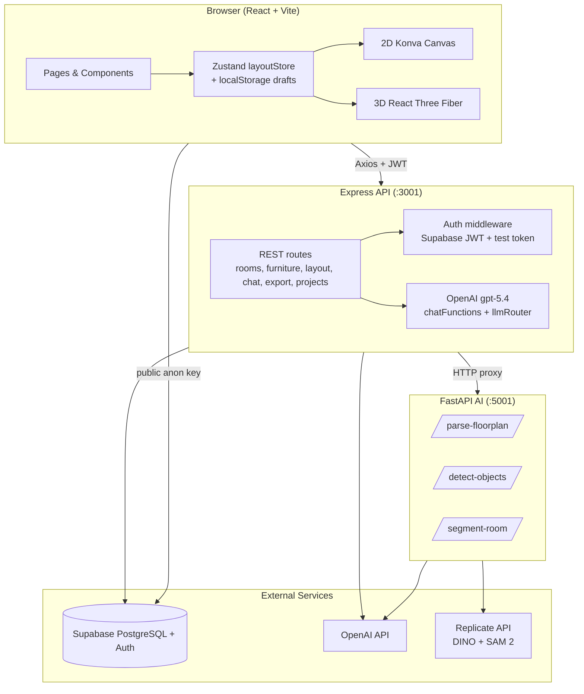
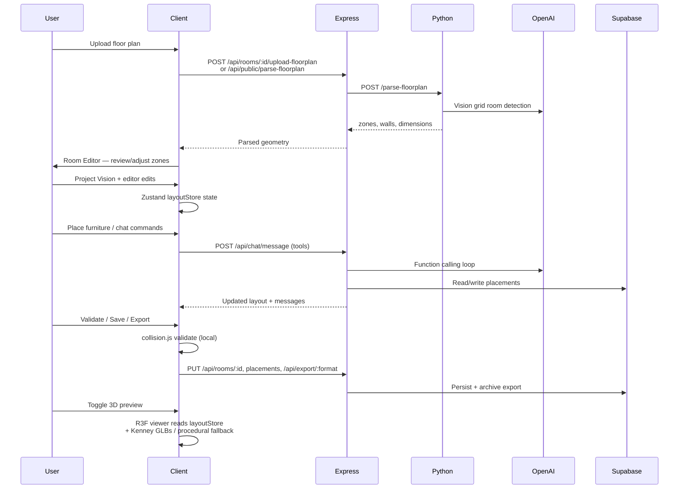

# Vision Studio — Architecture Overview

**CSE 115A Capstone · UCSC Spring 2026**

This document describes the system architecture of Vision Studio Spatial Layout Engine: a full-stack application for AI-assisted room layout design, furniture placement, 2D editing, 3D preview, and export.

---

## 1. System Context

Vision Studio is a **monorepo** with four deployable surfaces:

| Component | Technology | Default port | Role |
|-----------|------------|--------------|------|
| **Client** | React 18 + Vite 5 + Tailwind CSS 3 | 5173 | SPA UI, 2D Konva editor, 3D viewer, routing |
| **Server** | Express 4 (ES modules) | 3001 | REST API, auth, chat/LLM tools, export, DB access |
| **Python AI** | FastAPI 0.115 + OpenCV | 5001 | Floor plan parsing, room-photo detection/segmentation |
| **Database** | Supabase (PostgreSQL + Auth + Storage) | — | Persistent rooms, projects, placements, chat |
| **Marketing** (optional) | Next.js 16 + React 19 | 3000 | Separate landing/experiments app |

The browser **never** holds server secrets (`OPENAI_API_KEY`, `REPLICATE_API_TOKEN`, `SUPABASE_SERVICE_ROLE_KEY`). All privileged calls go through Express or Python.

---

## 2. High-Level Architecture Diagram

---

## 3. Client Architecture

### 3.1 Routing

React Router 6 lazy-loads pages from `client/src/pages/`. Key routes:

- `/studio` — project dashboard
- `/studio/project/:id/editor/:spaceId` — primary editor
- `/studio/project/:id/vision` — guided project vision intake
- `/studio/project/:id/confirm` — space review/adjust

See [Editor UX Flow](./editor-ux-flow.md) for the full product journey.

### 3.2 State management

`client/src/store/layoutStore.js` (Zustand + `persist`) is the single source of truth for:

- Current room geometry, zones, and interior (Materials)
- Furniture placements
- View mode (2D/3D), grid, tools, undo/redo stacks
- Chat history, catalog selection, active zone

Draft rooms (`draft-*` IDs) persist to `localStorage` (`vs-draft-v1`). Server-backed rooms load via `GET /api/rooms/:id`.

### 3.3 2D editor

- **Konva** (`react-konva`) renders the room canvas: grid, zones, walls, furniture, transformers.
- Placement uses inch-based coordinates with 6" grid snapping (`client/src/utils/scale.js`, `collision.js`).
- `RoomCanvas.jsx` handles click-to-place from the starter catalog, drag/transform, and wall/floor editing tools.

### 3.4 3D viewer

- **React Three Fiber** + `@react-three/drei` render room shells and furniture.
- Kenney CC0 GLBs live under `client/public/models/kenney/`; `furniture3d.js` resolves model URLs with procedural fallback.
- `RoomViewer3D.jsx` (single room) and `ProjectViewer3D.jsx` (all spaces) share shell/interior utilities.

### 3.5 Dual furniture catalogs

| Catalog | Source | Editor UI | Persistence |
|---------|--------|-----------|-------------|
| **Starter** (9 items) | `client/src/data/furnitureCatalog.js` | Furniture tab → click canvas | `POST/PUT /api/furniture/placements` |
| **API** (27 IKEA/Ashley) | `GET /api/furniture/catalog` | Space Assistant chat tools | Linked via `catalog_id` on placements |

---

## 4. Server Architecture

### 4.1 Entry and middleware

- `server/index.js` — process entry, graceful shutdown
- `server/app.js` — Express factory: Helmet, CORS (`corsOrigins.js`), rate limiting, route mounting, error handler

### 4.2 Route modules

| Module | Prefix | Responsibility |
|--------|--------|----------------|
| `auth.js` | `/api/auth` | Current user |
| `rooms.js` | `/api/rooms` | Room CRUD, floor plan upload, calibration |
| `projects.js` | `/api/projects` | Project + space CRUD |
| `furniture.js` | `/api/furniture` | Catalog search, placement CRUD |
| `layout.js` | `/api/layout` | Auto-place, validation |
| `chat.js` | `/api/chat` | Agentic chat (15 tools, up to 5 rounds) |
| `export.js` | `/api/export` | JSON/SVG/DXF download |
| `publicParse.js` | `/api/public` | Guest floor plan parse (no auth) |
| `recognition.js` | `/api/recognition` | Room photo proxy to Python |
| `models.js` | `/api/models` | Optional Meshy v2 3D generation |

### 4.3 Services layer

Key shared services:

- `supabase.js` / `db.js` — admin client; graceful placeholder when unconfigured
- `fallbackStore.js` — in-memory demo mode (27 embedded catalog items)
- `chatFunctions.js` — 15 LLM tool definitions + dispatch
- `overlapResolver.js` — shared placement overlap resolution
- `placementPersistence.js` — retries writes when optional DB columns are missing
- `exportFormats.js` — JSON/SVG/DXF generation
- `kenneyMapping.js` — API catalog → Kenney GLB paths at seed time

### 4.4 Authentication

`middleware/auth.js`:

- `requireAuth` — Supabase JWT verification
- `optionalAuth` — guest/draft support; invalid non-test tokens return **401**
- Fallback test account: `Bearer vs-test-token-001`

---

## 5. Python AI Service

`python/app.py` exposes three endpoints:

| Endpoint | Input | Pipeline |
|----------|-------|----------|
| `POST /parse-floorplan` | JPEG/PNG/WebP/PDF | GPT Vision (20×20 grid) → room zones → OpenCV wall-snap → fallback parser |
| `POST /detect-objects` | Image file or URL | Grounding DINO via Replicate |
| `POST /segment-room` | Image URL + bboxes | SAM 2 via Replicate |

Express proxies floor plan uploads to `PYTHON_SERVICE_URL` (default `http://localhost:5001`). The client does not call Python directly.

---

## 6. Data Layer

Supabase PostgreSQL with Row Level Security. Core tables:

- `providers`, `furniture_catalog` — seeded IKEA/Ashley catalog
- `rooms` — geometry, zones, interior (in `detected_objects` jsonb), floor plan URLs
- `placements` — furniture positions per room
- `projects`, `spaces` — multi-room project structure
- `layout_exports`, `chat_messages` — export archive and chat history

See [Data Model](./data-model.md) for entity relationships.

When Supabase credentials are missing or placeholder, the server runs **in-memory fallback mode** — sufficient for API smoke tests and local demos without a live database.

---

## 7. Main Data Flow

### Flow summary

1. **Upload** — floor plan image/PDF → Python parse → normalized `zones` on room
2. **Review** — user confirms/adjusts geometry in Room Editor
3. **Vision** — guided chips + chat → `global_vision` on project
4. **Editor** — Zustand holds live layout state (furniture, interior, zones)
5. **Placement** — starter catalog click-to-place or chat tool calls → placements
6. **Validation** — client-side AABB overlap/bounds check; server `/api/layout/validate` available
7. **Save** — explicit Save Project → rooms + placements to Supabase
8. **Export** — JSON/SVG/DXF blob download; archived in `layout_exports`
9. **3D preview** — client-side only; reads current state + GLB assets

---

## 8. Security and Production Hardening

- **Helmet** security headers on Express
- **Rate limiting** — 120 req/min general; 20/15min on auth routes
- **CORS** — credentials enabled; explicit origin allowlist (no `*`); Vercel preview support via `ALLOW_VERCEL_PREVIEWS`
- **Image proxy** — `/api/proxy-image` whitelists external product image domains for WebGL textures
- **Structured logging** — `services/logger.js` with slow-request and error warnings
- **Error boundaries** — React `ErrorBoundary` at app root
- **Code splitting** — manual Rollup chunks for React, Konva, Three.js, Framer Motion, Supabase

---

## 9. Testing Architecture

| Layer | Tool | Location |
|-------|------|----------|
| Client unit tests | Vitest + jsdom | `client/src/**/__tests__/` |
| Server API smoke | Vitest + Supertest (in-process) | `server/__tests__/e2e.smoke.test.js` (12 tests) |
| Server integration | Vitest | `placementPersistence`, `saveLoad` (skipped without real Supabase) |
| Browser E2E | Playwright (gitignored) | `e2e/` — local dev only |

---

## 10. Deployment Topology

Typical production layout:

| Service | Host | Build / start |
|---------|------|---------------|
| Client | Vercel | `vite build` |
| API | Render (`vision-studio-server`) | `npm start` |
| Python AI | Render (`vision-studio-python`) | `uvicorn app:app --host 0.0.0.0 --port $PORT` |
| Database | Supabase hosted project | `supabase/schema.sql` |

See [Deployment Notes](../deployment/deployment-notes.md) for environment variables and troubleshooting.

---

## 11. Related Documents

- [Data Model](./data-model.md) — database tables and relationships
- [Editor UX Flow](./editor-ux-flow.md) — product journey from the user's perspective
- [User Guide](../user-guide/user-guide.md) — step-by-step usage instructions
- [AGENTS.md](../../AGENTS.md) — maintainer reference (routes, env vars, behaviors)
