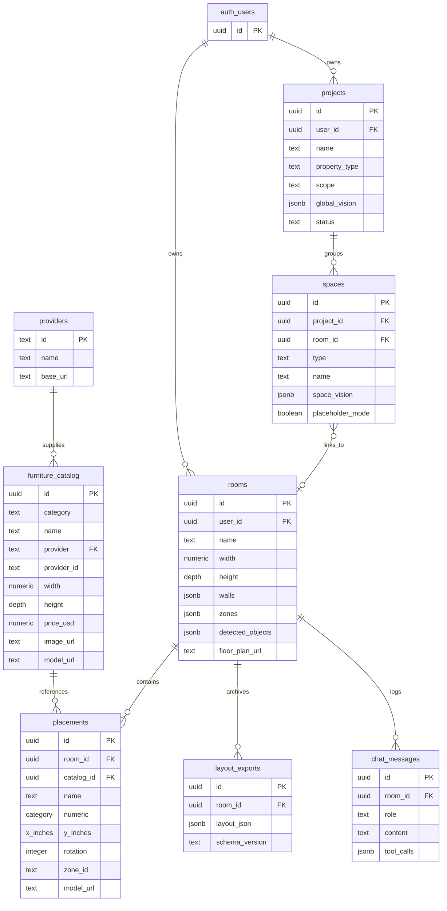

# Vision Studio — Data Model

**CSE 115A Capstone · UCSC Spring 2026**

This document describes the persistent data model for Vision Studio, based on `supabase/schema.sql` and how the Express server reads and writes these tables. No tables are documented here that do not exist in the schema.

---

## 1. Overview

Vision Studio uses **Supabase PostgreSQL** with **Row Level Security (RLS)**. Users can only access their own rooms, projects, placements, exports, and chat messages. The `furniture_catalog` table is publicly readable.

When Supabase is unavailable, the server falls back to an in-memory store (`server/services/fallbackStore.js`) that mirrors key entities for demo and testing.

---

## 2. Entity Relationship Diagram



---

## 3. Tables

### 3.1 `providers`

Seeded catalog vendors.

| Column | Type | Notes |
|--------|------|-------|
| `id` | `text` PK | e.g. `ikea`, `ashley`, `wayfair`, `custom` |
| `name` | `text` | Display name |
| `base_url` | `text` | Provider website |
| `active` | `boolean` | Default `true` |

**Seed data:** IKEA, Ashley, Wayfair, Custom (4 providers).

---

### 3.2 `furniture_catalog`

API-backed product catalog for chat tools and seeded placements.

| Column | Type | Notes |
|--------|------|-------|
| `id` | `uuid` PK | Auto-generated |
| `category` | `text` | e.g. seating, tables, beds |
| `name` | `text` | Product name |
| `provider` | `text` FK → `providers.id` | Default `custom` |
| `provider_id` | `text` | External SKU; unique with `provider` |
| `width`, `depth`, `height` | `numeric(8,2)` | Inches |
| `price_usd` | `numeric(10,2)` | Optional |
| `url` | `text` | Product page |
| `image_url` | `text` | Card/preview image |
| `model_url` | `text` | Kenney GLB path (set at seed via `kenneyMapping.js`) |
| `available` | `boolean` | Default `true` |

**RLS:** Public read (`anon` can SELECT).

**Seed:** 27 items (22 IKEA + 5 Ashley) via `server/scripts/seedFurniture.js`.

**Note:** The editor's **starter catalog** (9 items in `client/src/data/furnitureCatalog.js`) is client-side only and does not live in this table. Starter placements are stored as custom placements with inline dimensions and `model_url`.

---

### 3.3 `rooms`

The core editable room record — geometry, media, and detected data.

| Column | Type | Notes |
|--------|------|-------|
| `id` | `uuid` PK | |
| `user_id` | `uuid` FK → `auth.users` | Owner; cascade delete |
| `name` | `text` | Default `'My Room'` |
| `unit` | `text` | Default `'inches'` |
| `width`, `depth`, `height` | `numeric(8,2)` | Room dimensions (`height` default 96") |
| `walls` | `jsonb` | Wall segments or polygon outline |
| `scale_px_per_inch` | `numeric(10,4)` | Floor plan calibration |
| `floor_plan_url` | `text` | Uploaded floor plan image |
| `room_photo_url` | `text` | Room photo for recognition |
| `detected_objects` | `jsonb` | AI detections; **also stores `interior` (Materials)** when present |
| `zones` | `jsonb` | Confirmed sub-rooms: `[{id, name, polygon, bbox, color, width, depth}]` |
| `created_at`, `updated_at` | `timestamptz` | |

**RLS:** `auth.uid() = user_id` for all operations.

**Interior styling:** The Materials tab persists wall paint, wallpaper, wall art, and layout intent. The server stores this in `detected_objects.interior` (and merges it to a top-level `interior` field in API responses). There is no separate `interior` column in `schema.sql`.

**Zones:** Multi-room floor plans store per-space geometry here. Project `spaces` rows link to these rooms via `room_id`.

---

### 3.4 `placements`

Furniture items placed in a room.

| Column | Type | Notes |
|--------|------|-------|
| `id` | `uuid` PK | |
| `room_id` | `uuid` FK → `rooms` | Cascade delete |
| `catalog_id` | `uuid` FK → `furniture_catalog` | Optional; null for starter/custom items |
| `name` | `text` | Display name |
| `category` | `text` | |
| `provider`, `provider_id` | `text` | Source tracking |
| `width`, `depth`, `height` | `numeric(8,2)` | Inches — source of truth for collision/3D scale |
| `x_inches`, `y_inches` | `numeric(10,4)` | Position (top-left origin) |
| `rotation` | `integer` | Degrees (free-angle in editor) |
| `color` | `text` | Default `#d4a27a` |
| `custom` | `boolean` | Non-catalog item |
| `image_url` | `text` | Optional preview |
| `model_url` | `text` | Kenney GLB or other 3D asset |
| `zone_id` | `text` | Sub-room id matching `rooms.zones[].id` |

**RLS:** Via room ownership join.

**Client state:** `layoutStore.furniture` mirrors placements in the editor. `saveProject()` writes all placements via `PUT /api/furniture/placements/:id`.

---

### 3.5 `layout_exports`

Archived JSON exports for history retrieval.

| Column | Type | Notes |
|--------|------|-------|
| `id` | `uuid` PK | |
| `room_id` | `uuid` FK → `rooms` | |
| `layout_json` | `jsonb` | Full layout snapshot |
| `schema_version` | `text` | Default `'1.0'` |
| `created_at` | `timestamptz` | |

**RLS:** Via room ownership join.

**API:** `GET /api/export/latest/:room_id` retrieves the most recent export. JSON/SVG/DXF downloads also create export records for persisted rooms.

---

### 3.6 `chat_messages`

Per-room chat history for the Space Assistant.

| Column | Type | Notes |
|--------|------|-------|
| `id` | `uuid` PK | |
| `room_id` | `uuid` FK → `rooms` | |
| `role` | `text` | `user`, `assistant`, `system`, etc. |
| `content` | `text` | Message body |
| `tool_calls` | `jsonb` | LLM function call metadata |
| `model_used` | `text` | e.g. `gpt-5.4` |
| `created_at` | `timestamptz` | |

**RLS:** Via room ownership join.

**Note:** Draft/guest rooms skip DB chat writes. Global inspiration chat (`/chat`) and project-wide chat may use room-scoped or session-only storage depending on context.

---

### 3.7 `projects`

Multi-room / whole-property project metadata (Phase 2 alignment).

| Column | Type | Notes |
|--------|------|-------|
| `id` | `uuid` PK | |
| `user_id` | `uuid` FK → `auth.users` | |
| `name` | `text` | Default `'Untitled Project'` |
| `property_type` | `text` | e.g. Apartment, House |
| `scope` | `text` | `interior_only`, `exterior_only`, `interior_exterior` |
| `global_vision` | `jsonb` | Project Vision answers (mood, priorities, constraints) |
| `status` | `text` | Default `'in_progress'` |
| `created_at`, `updated_at` | `timestamptz` | |

**RLS:** `auth.uid() = user_id`.

---

### 3.8 `spaces`

Links project structure to editable `rooms`.

| Column | Type | Notes |
|--------|------|-------|
| `id` | `uuid` PK | |
| `project_id` | `uuid` FK → `projects` | Cascade delete |
| `room_id` | `uuid` FK → `rooms` | Nullable; `ON DELETE SET NULL` |
| `type` | `text` | `interior` or `exterior` |
| `name` | `text` | Space label |
| `category` | `text` | e.g. bedroom, patio |
| `space_vision` | `jsonb` | Per-space vision overrides |
| `placeholder_mode` | `boolean` | Exterior placeholder shell |
| `created_at`, `updated_at` | `timestamptz` | |

**RLS:** Via owning project.

**Geometry:** Durable zone polygons live on `rooms.zones`. The client also maintains a local compatibility overlay (`vs-projects-v1` in localStorage) for floorplan bbox/polygon metadata merged with API project data.

---

## 4. How Entities Relate in Practice

### Project → spaces → rooms → placements

```
projects (1) ──< spaces (N) ──> rooms (0..1)
                                    │
                                    ├──< placements (N)
                                    ├──< layout_exports (N)
                                    └──< chat_messages (N)
```

1. User creates a **project** with property type and scope.
2. Each **space** represents an interior or exterior area. When the space is editable, it links to a **room** (auto-created by the API if missing).
3. The **room** holds geometry (`width`, `depth`, `walls`, `zones`), Materials (`detected_objects.interior`), and media URLs.
4. **Placements** are furniture items inside that room, optionally scoped to a `zone_id` sub-room.
5. **Exports** and **chat_messages** hang off the room for history.

### Catalog → placements

- Chat-initiated furniture (`add_furniture` tool) creates placements with `catalog_id` pointing to `furniture_catalog`.
- Starter-catalog click-to-place creates placements with inline dimensions and `model_url`, typically with `custom: true` and no `catalog_id`.

---

## 5. Client-Side Persistence (Not in Schema)

These structures support guest mode and migration but are **not** database tables:

| Key / store | Purpose |
|-------------|---------|
| `vs-draft-v1` (localStorage) | Zustand persist for draft room + placements |
| `vs-projects-v1` (localStorage) | Project compatibility overlay (floorplan zones, local `globalVision`) |
| `layoutStore` (memory) | Live editor state: furniture, interior, zones, undo stacks |
| `selectedCatalogItem` (memory) | Session-only starter catalog pick for click-to-place |

---

## 6. Schema Application

Apply the full schema in the Supabase SQL Editor or via:

```bash
node server/scripts/applySchema.js [DB_PASSWORD]
cd server && node scripts/seedFurniture.js
cd server && node scripts/setup.js   # verify tables + connectivity
```

`/api/status` probes all eight tables (`providers`, `furniture_catalog`, `rooms`, `placements`, `layout_exports`, `chat_messages`, `projects`, `spaces`) and reports per-table connectivity.

---

## 7. Related Documents

- [Architecture Overview](./architecture-overview.md)
- [Editor UX Flow](./editor-ux-flow.md)
- [supabase/schema.sql](../../supabase/schema.sql) — source of truth
- [AGENTS.md](../../AGENTS.md) — API routes and persistence behaviors
