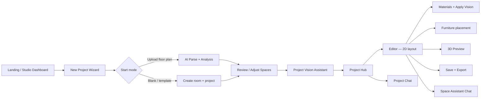

# Vision Studio — Editor UX Flow

**CSE 115A Capstone · UCSC Spring 2026**

This document explains the product flow from a user's perspective: how someone moves from landing page to a finished layout, and how the editor is structured. It reflects the implemented routes and components in the Vision Studio client.

---

## 1. Product Journey Overview



---

## 2. Entry Points

### 2.1 Landing page (`/`)

The homepage presents the six-step workflow story: Upload → Describe → Generate → Edit → Preview → Export. Primary CTAs route to:

- **New project** → `/studio/new`
- **Studio dashboard** → `/studio` (returning users)

### 2.2 Studio dashboard (`/studio`)

The project-first dashboard shows:

- Project cards with status, space counts, and last-updated metadata
- **New project** button → wizard
- Per-project actions: **Open project** (hub), **Continue editing** (editor)

API projects from Supabase merge with local compatibility drafts (`vs-projects-v1`) so migration-era drafts remain visible.

### 2.3 New project wizard (`/studio/new`)

Full-page wizard (replaces a modal). Steps:

1. **Start** — choose upload, blank room, or template
2. **Details** — project name, property type, scope (interior / exterior / both)
3. **Branch:**
   - **Upload** → embedded `Upload` page at `?projectId=:id&step=upload`
   - **Blank/template** → creates room + space, then confirm

Guests may see **ProjectSaveAuthModal** before vision or before continuing past space review.

---

## 3. Upload and Intake

### 3.1 Floor plan upload

Route: `/studio/new?startMode=upload` (also `/upload` redirects here).

1. User selects JPEG, PNG, WebP, or PDF.
2. **AnalysisWorkflow** overlay animates six pipeline stages.
3. AI service returns detected zones (rectangles or polygons).
4. User lands in space review.

**Guest path:** `POST /api/public/parse-floorplan` — no auth, no DB write until save.

### 3.2 Room photo (optional / prototype)

Room photo upload and object detection (Grounding DINO + SAM 2) exist via `/api/recognition/*` but are not the primary wizard path. Requires `REPLICATE_API_TOKEN` on the Python service.

---

## 4. Confirmation and Space Review

Route: `/studio/project/:id/confirm?mode=adjust`

**RoomEditor** (`upload/RoomEditor.jsx`) is the geometry source of truth:

| Action | Description |
|--------|-------------|
| Move / resize rooms | Drag handles on rectangular zones |
| Draw rooms | Rectangle (click-drag) or polygon (click vertices, close shape) |
| Rename | Edit room labels |
| Set type | Interior vs. exterior |
| Color overlay toggle | Filled vs. outline-only (visual; data unchanged) |
| Edit dimensions | Decoupled from drawn polygon shape |

Confirmed geometry persists to:

- `rooms.zones` (server-backed rooms)
- Local project overlay (`project.floorplan.zones`, `project.spaces[].geometry`)

**Canonical path:** Project hub **Review Spaces** → `?mode=adjust`.

Legacy `?phase=spaces` redirects to `?mode=adjust`.

---

## 5. Project Vision and Design Guidance

Route: `/studio/project/:id/vision` (optional `?setup=new` during guided onboarding)

**ProjectVisionIntake** provides:

- **Guided chip flow** — one question at a time (mood ≥2, priorities ≥2, constraints, room focus, room-specific needs)
- **Live chat** — Project Vision Assistant with project context
- **Readiness checklist** — shows completion state before continue

Output: `global_vision` jsonb on the `projects` table (plus local overlay).

### Explicit vision apply (no silent overwrite)

Vision does **not** auto-modify the editor on load. The user must click **Apply Vision to Layout**:

- **Materials tab** (`InteriorDesignPanel`) — primary UI
- **Space Assistant** — optional callback

`visionDesignApply.js` maps vision → interior presets, catalog hints, and starter placements in empty zones. User-edited Materials (`source: 'user'`) are protected unless the user chooses **Regenerate layout from vision** (`force: true`).

---

## 6. Project Hub

Route: `/studio/project/:id`

Central navigation between phases:

| Action | Destination |
|--------|-------------|
| **Open Editor** | First editable interior-linked space → `/editor/:spaceId` |
| **Open Project Vision Assistant** | `/vision` |
| **Review Spaces** | `/confirm?mode=adjust` |
| **Project Assistant** | `/chat` |
| **Continue guided setup** | Shown only while vision or confirmation is incomplete |

Hub shows Interior and Exterior space sections with add-space actions. Spaces without linked rooms show guidance instead of failing silently.

---

## 7. Editor Structure

Routes:

- `/studio/project/:id/editor` — full-floorplan mode (all spaces)
- `/studio/project/:id/editor/:spaceId` — room-scoped mode

Navbar and footer are hidden on editor routes.

### 7.1 Chrome layout

```
┌─────────────────────────────────────────────────────────────┐
│ StudioToolbar — save, 2D/3D, grid, tools, undo, validate   │
├──────┬──────────────────────────────────────────┬─────────────┤
│ Side │                                          │ ChatPanel   │
│ bar  │         RoomCanvas (2D) or               │ (optional)  │
│ tabs │         RoomViewer3D / ProjectViewer3D │             │
│      │                                          │             │
├──────┴──────────────────────────────────────────┴─────────────┤
│ ProjectSpaceBottomBar — All Spaces + space switcher           │
└─────────────────────────────────────────────────────────────┘
```

### 7.2 Left sidebar tabs (`EditorWorkspaceSidebar`)

| Tab | Content |
|-----|---------|
| **Spaces** | Interior/exterior space list; navigate between rooms |
| **Furniture** | Starter catalog search/filter; click-to-place selection |
| **Materials** | Wall paint, wallpaper, wall art, layout intent, Apply Vision |
| **Layers** | Furniture layer list for the active space |
| **Export** | JSON, SVG, DXF download buttons |

### 7.3 Toolbar actions (`StudioToolbar`)

| Control | Behavior |
|---------|----------|
| **Save Project** | Flush debounced edits; persist room + all placements |
| **Save to account** | Shown for drafts; opens LoginModal |
| **2D / 3D** | Toggle view mode |
| **Grid** | Show/hide snap grid |
| **Wall points** | Draggable wall joints (room-scoped, segment walls) |
| **Resize floor** | E/S/SE handles for floor dimensions |
| **Undo / Redo** | Furniture state snapshots |
| **Validate** | Client-side overlap and bounds check |
| **Auto-arrange** | Server LLM placement (when furniture exists) |
| **Chat toggle** | Space Assistant panel |
| **Shortcuts** | Keyboard reference popover |

---

## 8. 2D Editing

**RoomCanvas** (Konva) in room-scoped mode:

- Pan/zoom canvas
- Zone polygons rendered as `Line` (not just bounding boxes)
- Click-to-place from starter catalog (grid-snapped)
- Drag/transform furniture with Konva `Transformer`
- Free-angle rotation (transformer handle, ±15° nudges, slider)
- Wall joint handles and floor resize handles (mutually exclusive tools)
- Esc clears tools and catalog selection

**ProjectCanvas** in full-floorplan mode:

- SVG overlay on floor plan image
- Color overlay toggle
- Space selection zooms context; furniture editing requires room-scoped view

### Collision and fit feedback

- Placement blocked or warned when items overlap or exceed room/zone bounds
- Toolbar **Validate** runs `validateAll()` and shows toast with first errors
- Space Assistant can call `validate_layout` server-side

---

## 9. Furniture Catalog UX

### Starter catalog (editor Furniture tab)

- 9 curated items in `furnitureCatalog.js`
- Kenney GLB previews under `/models/kenney/`
- Flow: select card → click canvas → item appears
- Esc or **Clear selection** cancels

### API catalog (IKEA/Ashley — 27 items)

- Not browsable in the editor sidebar
- Accessed via Space Assistant tool calls (`suggest_furniture`, `add_furniture`, `swap_furniture`, `furnish_room`)
- Persists with `catalog_id` on placements

---

## 10. Materials and Design Options

**InteriorDesignPanel** (Materials tab):

| Section | What it controls |
|---------|------------------|
| Wall paint | Preset colors → `room.interior.wallColor` |
| Wallpaper | Pattern presets → 2D canvas textures + 3D planes |
| Wall art | Placement on cardinal walls |
| Layout intent | Guidance copy from vision |
| Apply Vision | Explicit layout generation from `globalVision` |

User edits set `source: 'user'` and `userEditedAt` — protected from silent vision overwrite.

2D rendering: `RoomInteriorSurfaces.jsx` (Konva).
3D rendering: `RoomInterior3D.jsx` (R3F).

---

## 11. 3D Preview

Toggle via toolbar **3D** button.

| Mode | Component | What you see |
|------|-----------|--------------|
| Room-scoped | `RoomViewer3D` | Shell, Materials, furniture GLBs |
| All spaces | `ProjectViewer3D` | Floorplan-relative space shells |

**RoomSceneControls:** Overview / Walkthrough camera presets, Reset view.

### MVP limitations

- Scanned polygon walls are not extruded as architectural 3D meshes
- Orbit controls only — no WASD pointer-lock walkthrough
- Project-wide 3D needs confirmed floorplan geometry; shows fallback otherwise
- Exterior spaces use placeholder shells
- GLBs are visual-only; catalog inch dimensions govern placement scale

---

## 12. Save and Load

| State | Storage | Save action |
|-------|---------|-------------|
| Guest draft | `localStorage` (`vs-draft-v1`) | **Save to account** → auth → `saveDraftToAccount()` |
| Signed-in room | Supabase `rooms` + `placements` | **Save Project** → `saveProject()` |
| Project metadata | Supabase `projects` + `spaces` + local overlay | Hub and wizard flows |

`loadRoomFailed` redirects to `/studio` with a toast if a room cannot be loaded.

---

## 13. Export

**Export tab** in sidebar (`useRoomExport` hook):

- **JSON** — structured layout data
- **SVG** — 2D vector
- **DXF** — CAD interchange

Draft rooms POST layout state to `/api/export/:format/draft`. Saved rooms POST to `/api/export/:format/:room_id`.

---

## 14. Chat Surfaces

| Surface | Route / location | Purpose |
|---------|------------------|---------|
| Design Inspiration | `/chat` | Global style ideas; local transcript |
| Project Assistant | `/studio/project/:id/chat` | Whole-property Q&A |
| Space Assistant | Editor `ChatPanel` | Layout manipulation via 15 LLM tools |

Chat in the editor can add/move/remove API catalog furniture, auto-arrange, validate, and trigger vision apply.

---

## 15. Guided vs. Free Navigation

**Guided new-project flow** (wizard + `?setup=new`):

```
/studio/new → upload or blank → confirm spaces → vision → hub → editor
```

**Existing projects** opened from `/studio` go directly to the **hub** — no forced redirect to vision or confirm.

**Continue guided setup** on the hub appears only while vision or space confirmation is incomplete.

---

## 16. MVP Limitations Summary

| Area | Limitation |
|------|------------|
| Floor plan parse | Requires manual review; not survey-grade |
| Room photo AI | Prototype; needs Replicate token |
| Furniture browse | Sidebar = 9 starter items only; 27 API items via chat |
| 3D walls | Bounding-box shells; no polygon extrusion |
| 3D navigation | Orbit only |
| Exterior spaces | Placeholder mode, limited editing |
| Per-space interior in 3D all-spaces view | Shared room interior tint until per-space modeled |
| Auto-save | Debounced room edits; explicit **Save Project** for full persist |
| E2E browser tests | Playwright tooling gitignored; not part of submission binary |

---

## 17. Related Documents

- [User Guide](../user-guide/user-guide.md) — step-by-step instructions for graders
- [Architecture Overview](./architecture-overview.md) — system components and data flow
- [Data Model](./data-model.md) — database entities
- [AGENTS.md](../../AGENTS.md) — route table and behavior reference
